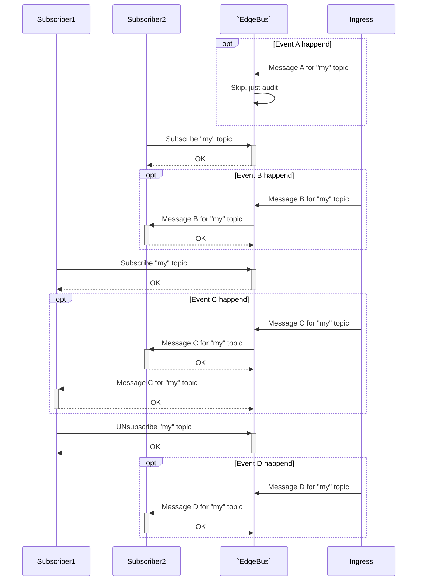
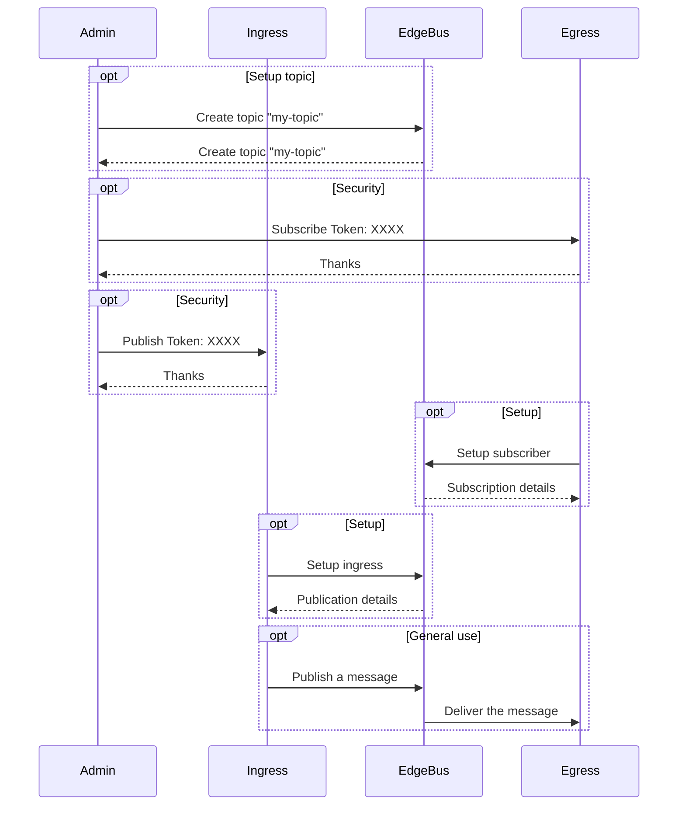
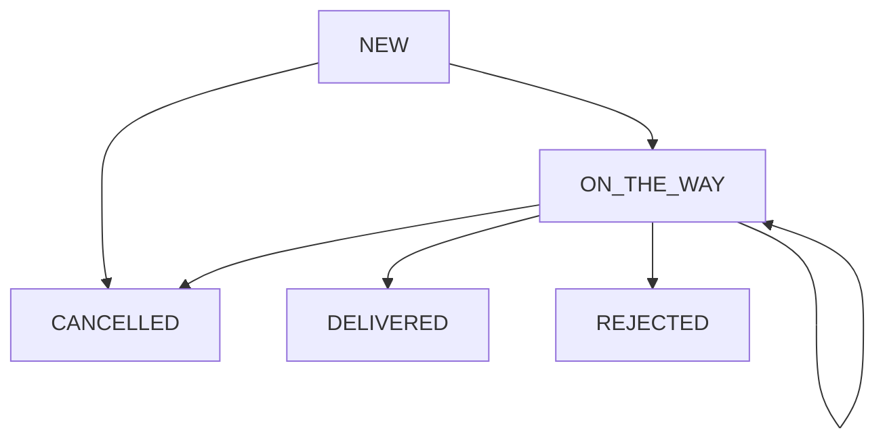
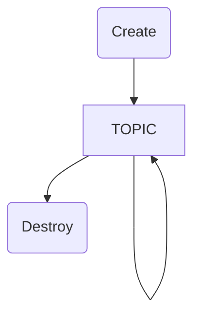

# EdgeBus

[EdgeBus](https://docs.edgebus.io) is an application level network edge bus that adds connectivity, auditability, and observability to your apps with no code changes.

# TypeScript of EdgeBus Service

[](https://www.npmjs.com/package/@zxteam/notification.service)
[](https://www.npmjs.org/package/@zxteam/notification.service)
[](https://github.com/zxteamorg/node.notification.service/pulse)
[](https://github.com/zxteamorg/node.notification.service/graphs/commit-activity)
[](https://twitter.com/zxteamorg)

This is `src-typescript-service` branch of **EdgeBus** multi project repository based on [orphan](https://git-scm.com/docs/git-checkout#Documentation/git-checkout.txt---orphanltnew-branchgt) branches.

## Developer Notes

### Start locally

```shell
cp .env-example .env
nvm use 18
npm install
npm run build
npm start
```

Check 


## General information

### Use-cases



### Delivery
Messages are sent immediately after an operation was performed.

`EdgeBus` records the fact of message delivery to your system after receiving the response from your system.

If message delivery is failed the server will retry with delay between attempts according to a scale was choosen at subscription phase.

For example powers of two scale will retry delivery until the period does not exceed 16384 seconds (~4.5hours): 1, 2, 4, 8, 16, ..., 16384(max).

Notification server performs attempts to deliver a message within 3 days.

### Selecting delivery format
Along with setup your notification endpoint, you may choose message format.

#### [JSON-RPC](https://www.jsonrpc.org/specification)
Using JSON-RPC in notification manner
```JSON
--> {"jsonrpc": "2.0", "method": "somethingChanged", "params": { "id": "68ac6741f92d41fbbc894ab406fcc91d", ...... }}
--> {"jsonrpc": "2.0", "method": "somethingAdded", "params": { "id": "3d80cbbe", ...... }}
```

#### [Protocol Buffers Version 2](https://developers.google.com/protocol-buffers/docs/reference/proto2-spec)
Using Protocol Buffers for message serialization. See definition .proto file for details.

### Message security
`EdgeBus` does tranfer messages as-is. There is `Ingress`'s responsibility to provide desired kind of security like **encrypting**, **signing**, etc.

However implementation of **subscribers** may provide additional security. For example Webhook provides a token header and SSL validation. See a subscriber documentation for details.

## Administration flow



## Messages
### Life-cycle


## Topics

### Life-cycle


### Setup

#### List Topics
##### Request for public topic
```bash
$ curl --verbose --request GET https://notifier.zxteam.org/management/topic
```

##### Request for private topic
```bash
$ curl --verbose --key ./admin-key.pem --cert ./admin-cert.pem --request GET https://notifier.zxteam.org/management/topic
```

##### Response
```json
[
	{
		"name": "MyGitLabPushTopic.yourdomain.ltd",
		"mediaType":"application/json",
		"description":"...",
		"createAt":"2020-01-14T22:17:32.324Z",
		"deleteAt":null
	},
	{
		"name": "MyGitLabPushTopic2.yourdomain.ltd",
		"mediaType":"application/json",
		"description":"...",
		"createAt":"2020-01-14T22:17:32.324Z",
		"deleteAt":null
	},
	...
]
```

#### Create Topic
##### Body
```bash
$ cat docs/topic/create-topic.json
```
```json
{
	"name": "MyGitLabPushTopic",
	"description": "My first topic to handle GitLab's push events. See https://docs.gitlab.com/ee/user/project/integrations/webhooks.html#push-events",
	"schema": {
		"$schema": "http://json-schema.org/draft-07/schema",
		...
	}
}
```

##### Request for public topic
```bash
$ curl --verbose --request POST --header 'Content-Type: application/json' https://notifier.zxteam.org/management/topic --data @docs/topic/create-topic.json
```

##### Request for private topic
```bash
$ curl --verbose --key ./admin-key.pem --cert ./admin-cert.pem --request POST --header 'Content-Type: application/json'  https://notifier.zxteam.org/management/topic --data @docs/topic/create-topic.json
```

##### Response
```json
{
	"name": "MyGitLabPushTopic.yourdomain.ltd",
	"security": {
		"kind": "TOKEN",
		"token": "XXXXXXXXXXXXXXXXXXXXXXXXXXXXXXXXXXXXXXXXXXXXXXXXXXXXXXXXXXXXXXXX"
	}
}
```
NOTE: `yourdomain.ltd` is comming from your SSL certificate `admin-cert.pem` (field: CN)

#### Delete Topic
```bash
$ cat docs/topic/delete-topic.json
```
```json
{
	"topicSecurity": {
		"kind": "TOKEN",
		"token": "XXXXXXXXXXXXXXXXXXXXXXXXXXXXXXXXXXXXXXXXXXXXXXXXXXXXXXXXXXXXXXXX"
	}
}
```
```bash
$ curl --verbose --request DELETE --header 'Content-Type: application/json' https://notifier.zxteam.org/management/MyGitLabPushTopic.yourdomain.ltd --data @docs/topic/delete-topic.json
```
```json
{
	"deleteDate": "2019-10-10T12:00:01.223Z",
	"pendingMessages": 342,
	"totalMessages": 444321
}
```


## Publishers
Any ingress may be deleted by following request
```bash
$ cat docs/ingress/delete-ingress.json
```
```json
{
	"publisherSecurity": {
		"kind": "TOKEN",
		"token": "XXXXXXXXXXXXXXXXXXXXXXXXXXXXXXXXXXXXXXXXXXXXXXXXXXXXXXXXXXXXXXXX"
	},
	"ssl": {
		... optional
	}
}
```
```bash
$ curl --verbose --request DELETE --header 'Content-Type: application/json' https://notifier.zxteam.org/management/ingress/ingress.http.641f97ec-31d0-418b-a594-0e9aa3a356a5 --data @docs/ingress/delete-ingress.json
```
```json
{
	"deleteDate": "2019-10-10T12:00:01.223Z"
}
```

### HTTP Endpoint
HTTP Ingress allows to publish messages via HTTP protocol.

#### Create ingress endpoint
```bash
$ cat docs/ingress/create-http-ingress.json
```
```json
{
	"topic": "MyGitLabPushTopic.yourdomain.ltd",
	"publisherSecurity": {
		"kind": "TOKEN",
		"token": "XXXXXXXXXXXXXXXXXXXXXXXXXXXXXXXXXXXXXXXXXXXXXXXXXXXXXXXXXXXXXXXX"
	},
	"ssl": {
		... optional
	}
}
```
```bash
$ curl --verbose --request POST --header 'Content-Type: application/json' https://notifier.zxteam.org/management/ingress/http --data @docs/ingress/create-http-ingress.json
```
```json
{
	"ingressId": "ingress.http.18af3285-749a-4fe8-abc0-52a42cd82cb6",
	"url": "https://notifier.zxteam.org/ingress/http/18af3285-749a-4fe8-abc0-52a42cd82cb6"
}
```
#### Push message
```bash
curl --verbose --header 'Content-Type: application/json' https://notifier.zxteam.org/ingress/http/18af3285-749a-4fe8-abc0-52a42cd82cb6 --data '{"hello":"world"}'
```


## Subscribers
### List subscribers (GET)
```bash
$ curl --verbose --request GET 'https://notifier.zxteam.org/management/subscriber?security.kind=TOKEN&security.token=XXXXXXXXXXXXXXXXXXXXXXXXXXXXXXXXXXXXXXXXXXXXXXXXXXXXXXXXXXXXXXXX
```
```json
[
	{
		"kind": "webhook",
		"egressId": "subscriber.webhook.23c3167c-910f-486d-966b-89ac59c6080a",
		...
	},
	{
		"kind": "webhook",
		"egressId": "subscriber.webhook.c3e57dd6-f5c9-4cf3-9ed5-8747bcec4372",
		...
	},
	{
		"kind": "websockethost",
		"egressId": "subscriber.websockethost.18af3285-749a-4fe8-abc0-52a42cd82cb6",
		...
	},
	...
]
```

### Delete subscriber (DELETE)
```bash
$ cat docs/subscriber/delete-subscriber.json
```
```json
{
	"security": {
		"kind": "TOKEN",
		"token": "XXXXXXXXXXXXXXXXXXXXXXXXXXXXXXXXXXXXXXXXXXXXXXXXXXXXXXXXXXXXXXXX"
	}
}
```
```bash
$ curl --verbose --request DELETE --header 'Content-Type: application/json' https://notifier.zxteam.org/management/subscriber/subscriber.webhook.2733f6e9-c405-46d1-969e-2b42e4a4dc42 --data @docs/subscriber/delete-subscriber.json
```
```json
{
	"deleteDate": "2019-10-10T12:00:01.223Z"
}
```


### Webhook
[Webhooks](https://en.wikipedia.org/wiki/Webhook) are "user-defined HTTP
callbacks".
When an event occurs, `EdgeBus` makes an HTTP request to the URI configured for the webhook.

>>>
**Warning:** Your endpoint should ALWAYS return a valid HTTP response with HTTP status 2XX. If you do not do this then EdgeBus will think the hook failed and [retry](#delivery) it.
>>>

#### SSL verification
SSL Verification enables automatically for URL scheme `https:`. No additional configuration required.

>>>
**Optional:** If you specify a CA Certificates in a `trustedCA` field of create subscriber request, it will be used to verify the SSL certificate of the webhook endpoint.
If `trustedCA` is omited the SSL certificate of the webhook endpoint is verified based on an internal list of Certificate Authorities.
>>>

#### Secret token
If you specify a secret token in a `headerToken` field of create subscriber request, it will be sent along with the hook request in the **NF-TOKEN** HTTP header.

#### Create subscriber endpoint
```bash
$ cat docs/subscriber/create-webhook-subscriber.json
```
```json
{
	"topic": "MyGitHubEventsTopic.yourdomain.ltd",
	"subscriberSecurity": {
		"kind": "TOKEN",
		"token": "XXXXXXXXXXXXXXXXXXXXXXXXXXXXXXXXXXXXXXXXXXXXXXXXXXXXXXXXXXXXXXXX"
	},
	"url": "https://callback.yourdomain.ltd/my-github-commits",
	"trustedCA": "-----BEGIN CERTIFICATE-----\nMII.....\n-----END CERTIFICATE-----", // ...optional
	"headerToken": "my-secret-words-for-NF-TOKEN-header", // ...optional
	"transformers": [ // ...optional
	]
}
```
```bash
$ curl --verbose --request POST --header 'Content-Type: application/json' https://notifier.zxteam.org/subscriber/webhook --data @docs/subscriber/create-webhook-subscriber.json
```
```json
{
	"kind": "webhook",
	"egressId": "subscriber.webhook.23c3167c-910f-486d-966b-89ac59c6080a",
	"topic": "MyGitHubEventsTopic.yourdomain.ltd",
	"url": "https://callback.yourdomain.ltd/my-github-commits",
	"trustedCA": "-----BEGIN CERTIFICATE-----\nMII.....\n-----END CERTIFICATE-----", // ...optional
	"headerToken": "my-secret-words-for-NF-TOKEN-header", // ...optional
	"transformers": [ // ...optional
	]
}
```


### WebSocket (Host Mode)
This kind of subscriber allows to receive messages through WebSocket channel. `Host Mode` means that message subscriber connects to `EdgeBus` as client.

#### Create subscriber endpoint
```bash
$ cat docs/subscriber/create-websocket-host-subscriber.json
```
```json
{
	"topic": "MyGitLabPushTopic.yourdomain.ltd",
	"subscriberSecurity": {
		"kind": "TOKEN",
		"token": "XXXXXXXXXXXXXXXXXXXXXXXXXXXXXXXXXXXXXXXXXXXXXXXXXXXXXXXXXXXXXXXX"
	},
	"ssl": {
		... optional
	}
}
```
```bash
$ curl --verbose --request POST --header 'Content-Type: application/json' https://notifier.zxteam.org/subscriber/websockethost --data @docs/subscriber/create-websocket-host-subscriber.json
```
```json
{
	"kind": "websockethost",
	"egressId": "subscriber.websockethost.18af3285-749a-4fe8-abc0-52a42cd82cb6",
	"url": "wss://notifier.zxteam.org/subscriber/websockethost/18af3285-749a-4fe8-abc0-52a42cd82cb6"
}
```
#### Listen subscriber endpoint
```
wscat --connect wss://notifier.zxteam.org/subscriber/websockethost/18af3285-749a-4fe8-abc0-52a42cd82cb6
```


https://api.telegram.org/bot957337804:AAEfHSDXPDKJtWbyHB-e09579zmC-_h7SLE/getMe
https://api.telegram.org/bot957337804:AAEfHSDXPDKJtWbyHB-e09579zmC-_h7SLE/getUpdates
```json
{"ok":true,"result":[
	{"update_id":554918867,"message":{"message_id":2,"from":{"id":867014308,"is_bot":false,"first_name":"Maksym","last_name":"Anurin","username":"theanurin","language_code":"en"},"chat":{"id":867014308,"first_name":"Maksym","last_name":"Anurin","username":"theanurin","type":"private"},"date":1577446910,"text":"\u043f\u0440\u0438\u0432\u0435\u0442"}},
	{"update_id":554918868,
"message":{"message_id":5,"from":{"id":867014308,"is_bot":false,"first_name":"Maksym","last_name":"Anurin","username":"theanurin","language_code":"en"},"chat":{"id":-383073836,"title":"CPEmulatorNotification","type":"group","all_members_are_administrators":true},"date":1577447428,"group_chat_created":true}},{"update_id":554918869,
"message":{"message_id":6,"from":{"id":867014308,"is_bot":false,"first_name":"Maksym","last_name":"Anurin","username":"theanurin","language_code":"en"},"chat":{"id":-383073836,"title":"CPEmulatorNotification","type":"group","all_members_are_administrators":true},"date":1577447460,"new_chat_participant":{"id":384745746,"is_bot":false,"first_name":"Vladimir","last_name":"Syniakin"},"new_chat_member":{"id":384745746,"is_bot":false,"first_name":"Vladimir","last_name":"Syniakin"},"new_chat_members":[{"id":384745746,"is_bot":false,"first_name":"Vladimir","last_name":"Syniakin"}]}},{"update_id":554918870,
"message":{"message_id":7,"from":{"id":867014308,"is_bot":false,"first_name":"Maksym","last_name":"Anurin","username":"theanurin","language_code":"en"},"chat":{"id":-383073836,"title":"CPEmulatorNotification","type":"group","all_members_are_administrators":true},"date":1577447489,"text":"/start","entities":[{"offset":0,"length":6,"type":"bot_command"}]}}]}
```

curl -v -X POST --header "Content-Type: application/json" --data '{"chat_id":"-383073836","text":"`hello` amigo","parse_mode":"Markdown"}' https://api.telegram.org/bot957337804:AAEfHSDXPDKJtWbyHB-e09579zmC-_h7SLE/sendMessage


```bash
curl https://api.telegram.org/bot1036097604:AAHLVqwfabEmFu4Ou4nmCYXxAo2ffjB3Mmo/getMe
```
```json
{"ok":true,"result":{"id":1036097604,"is_bot":true,"first_name":"ZXTeam\u2019s EdgeBus","username":"zxteam_notifier_bot"}}
```

```bash
curl https://api.telegram.org/bot1036097604:AAHLVqwfabEmFu4Ou4nmCYXxAo2ffjB3Mmo/getUpdates
```
```json
{
	"ok":true,
	"result":[
		{
			"update_id":807119542,
			"message":{
				"message_id":1,
				"from":{
					"id":867014308,
					"is_bot":false,
					"first_name":"Maksym",
					"last_name":"Anurin",
					"username":"theanurin"
				},
				"chat":{
					"id":-347824729,"title":"ZXTeam\u2019s EdgeBus",
					"type":"group",
					"all_members_are_administrators":true
				},
				"date":1577452660,
				"group_chat_created":true
			}
		},
		{
			"update_id":807119543,
			"message":{
				"message_id":2,
				"from":{"id":277364372,"is_bot":false,"first_name":"Serhii","last_name":"Zghama","username":"serhiizghama"},
				"chat":{"id":-347824729,"title":"ZXTeam\u2019s EdgeBus","type":"group","all_members_are_administrators":true},
				"date":1577452697,
				"text":"/hello",
				"entities":[{"offset":0,"length":6,"type":"bot_command"}]
			}
		}
]
}
`

curl -v -X POST --header "Content-Type: application/json" --data '{"chat_id":"-347824729","text":"{\\"echo\\":\\"hello\\",\\"time\\":\\"2019-12-27T13:25:18.341Z\\",\\"version\\":\\"0.0.3\\"}"}' https://api.telegram.org/bot1036097604:AAHLVqwfabEmFu4Ou4nmCYXxAo2ffjB3Mmo/sendMessage
