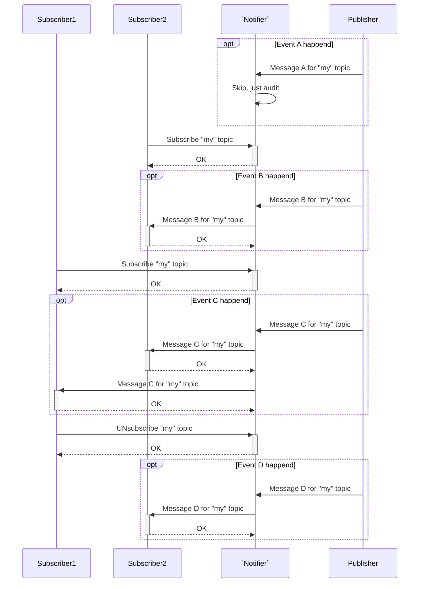
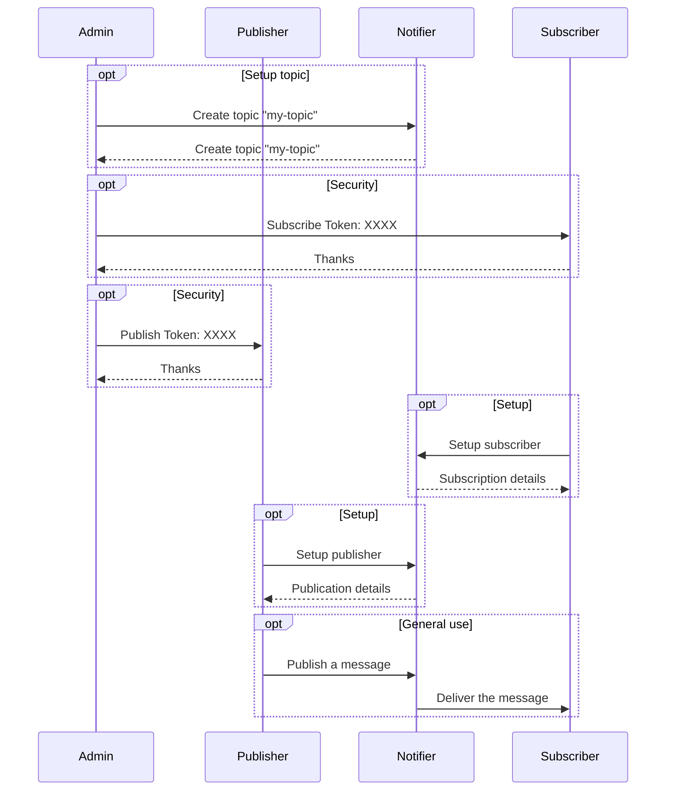
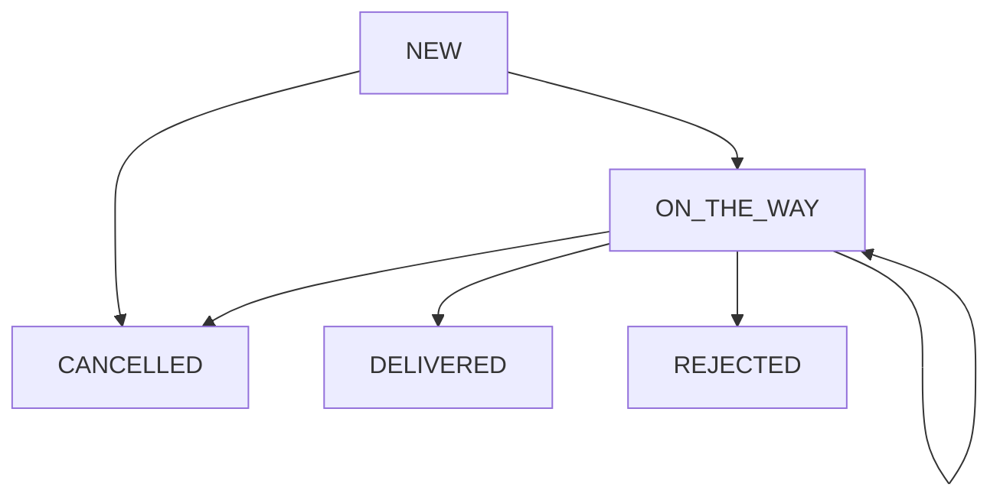
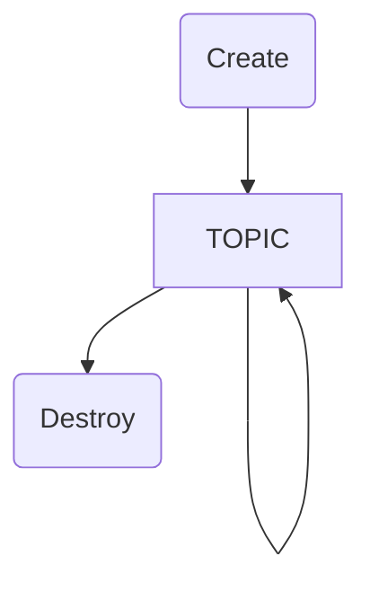

# ZXTeam's Notification Service
[](https://www.npmjs.com/package/@zxteam/notification.service)
[](https://www.npmjs.org/package/@zxteam/notification.service)
[](https://github.com/zxteamorg/node.notification.service/pulse)
[](https://github.com/zxteamorg/node.notification.service/graphs/commit-activity)
[](https://twitter.com/zxteamorg)

# Notifier
`Notifier` is a Notification Server that implements [Publish–Subscribe](https://en.wikipedia.org/wiki/Publish%E2%80%93subscribe_pattern) Pattern. Main responsibility is to deliver callback messages via Webhooks and other messaging providers.

>>>
**Recommendation:** Although notification includes real and valid data, we recommend to use notifications just as notifications and retvieve data via appropriate method of Pull API.
In general, any notifications system by design may delay messages. Good practice for end-application is to check status via Pull API if expected message was not received in expected time frame.
>>>

## Our instances
We are hosting sereval public instances. You can use its for dry-run, integration development, etc...

Currently **PRODUCTION** instance does not provide any guarantees and may be shut-down, wipe-data, etc... Use it just for testing.

### Production
Release from tag

| Title                                       | URL                                                     |
|---------------------------------------------|---------------------------------------------------------|
| Self-hosted docs                            | https://notifier.pub.zxteam.org/docs                    |
| Managment API                               | https://notifier.pub.zxteam.org/management              |
| Publisher API                               | https://notifier.pub.zxteam.org/publisher               |
| Subscriber API                              | https://notifier.pub.zxteam.org/subscriber              |

### Presentation
Usually latest tag (sometimes `master` branch)

| Title                                       | URL                                                     |
|---------------------------------------------|---------------------------------------------------------|
| Self-hosted docs                            | https://notifier.pub.zxteam.org:10443/docs              |
| Managment API                               | https://notifier.pub.zxteam.org:10443/management        |
| Publisher API                               | https://notifier.pub.zxteam.org:10443/publisher         |
| Subscriber API                              | https://notifier.pub.zxteam.org:10443/subscriber        |

### Evolution
Usually `master` branch (sometimes `dev` branch)

| Title                                       | URL                                                     |
|---------------------------------------------|---------------------------------------------------------|
| Self-hosted docs                            | https://notifier.pub.zxteam.org:20443/docs              |
| Managment API                               | https://notifier.pub.zxteam.org:20443/management        |
| Publisher API                               | https://notifier.pub.zxteam.org:20443/publisher         |
| Subscriber API                              | https://notifier.pub.zxteam.org:20443/subscriber        |


## General information

### Use-cases



### Delivery
Messages are sent immediately after an operation was performed.

`Notifier` records the fact of message delivery to your system after receiving the response from your system.

If message delivery is failed the server will retry with delay between attempts according to a scale was choosen at subscription phase.

For example powers of two scale will retry delivery until the period does not exceed 16384 seconds (~4.5hours): 1, 2, 4, 8, 16, ..., 16384(max).

Notification server performs attempts to deliver a message within 3 days.

### Selecting delivery format
Along with setup your notification endpoint, you may choose message format.

#### [JSON-RPC](https://www.jsonrpc.org/specification)
Using JSON-RPC in notification manner
```JSON
--> {"jsonrpc": "2.0", "method": "somethingChanged", "params": { "id": "68ac6741f92d41fbbc894ab406fcc91d", ...... }}
--> {"jsonrpc": "2.0", "method": "somethingAdded", "params": { "id": "3d80cbbe", ...... }}
```

#### [Protocol Buffers Version 2](https://developers.google.com/protocol-buffers/docs/reference/proto2-spec)
Using Protocol Buffers for message serialization. See definition .proto file for details.

### Message security
`Notifier` does tranfer messages as-is. There is `Publisher`'s responsibility to provide desired kind of security like **encrypting**, **signing**, etc.

However implementation of **subscribers** may provide additional security. For example Webhook provides a token header and SSL validation. See a subscriber documentation for details.

## Administration flow



## Messages
### Life-cycle


## Topics

### Life-cycle


### Setup

#### Create Topic
```bash
$ cat docs/topic/create-topic.json
```
```json
{
	"name": "MyGitLabPushTopic",
	"description": "My first topic to handle GitLab's push events. See https://docs.gitlab.com/ee/user/project/integrations/webhooks.html#push-events",
	"schema": {
		"$schema": "http://json-schema.org/draft-07/schema",
		...
	}
}
```
```bash
$ curl --verbose --key ./admin-key.pem --cert ./admin-cert.pem --method POST --header 'Content-Type: application/json'  https://notifier.pub.zxteam.org/management/topic --data @docs/topic/create-topic.json
```
```json
{
	"name": "MyGitLabPushTopic.yourdomain.ltd",
	"topicSecurity": {
		"kind": "TOKEN",
		"token": "XXXXXXXXXXXXXXXXXXXXXXXXXXXXXXXXXXXXXXXXXXXXXXXXXXXXXXXXXXXXXXXX"
	},
	"publisherSecurity": {
		"kind": "TOKEN",
		"token": "XXXXXXXXXXXXXXXXXXXXXXXXXXXXXXXXXXXXXXXXXXXXXXXXXXXXXXXXXXXXXXXX"
	},
	"subscriberSecurity": {
		"kind": "TOKEN",
		"token": "XXXXXXXXXXXXXXXXXXXXXXXXXXXXXXXXXXXXXXXXXXXXXXXXXXXXXXXXXXXXXXXX"
	}
}
```
NOTE: `yourdomain.ltd` is comming from your SSL certificate `admin-cert.pem` (field: CN)

#### Delete Topic
```bash
$ cat docs/topic/delete-topic.json
```
```json
{
	"topicSecurity": {
		"kind": "TOKEN",
		"token": "XXXXXXXXXXXXXXXXXXXXXXXXXXXXXXXXXXXXXXXXXXXXXXXXXXXXXXXXXXXXXXXX"
	}
}
```
```bash
$ curl --verbose --method DELETE --header 'Content-Type: application/json' https://notifier.pub.zxteam.org/management/MyGitLabPushTopic.yourdomain.ltd --data @docs/topic/delete-topic.json
```
```json
{
	"deleteDate": "2019-10-10T12:00:01.223Z",
	"pendingMessages": 342,
	"totalMessages": 444321
}
```


## Publishers
Any publisher may be deleted by following request
```bash
$ cat docs/publisher/delete-publisher.json
```
```json
{
	"publisherSecurity": {
		"kind": "TOKEN",
		"token": "XXXXXXXXXXXXXXXXXXXXXXXXXXXXXXXXXXXXXXXXXXXXXXXXXXXXXXXXXXXXXXXX"
	},
	"ssl": {
		... optional
	}
}
```
```bash
$ curl --verbose --method DELETE --header 'Content-Type: application/json' https://notifier.pub.zxteam.org/publisher/publisher.http.641f97ec-31d0-418b-a594-0e9aa3a356a5 --data @docs/publisher/delete-publisher.json
```
```json
{
	"deleteDate": "2019-10-10T12:00:01.223Z"
}
```

### HTTP Endpoint
HTTP Publisher allows to publish messages via HTTP protocol.

#### Create publisher endpoint
```bash
$ cat docs/publisher/create-http-publisher.json
```
```json
{
	"topic": "MyGitLabPushTopic.yourdomain.ltd",
	"publisherSecurity": {
		"kind": "TOKEN",
		"token": "XXXXXXXXXXXXXXXXXXXXXXXXXXXXXXXXXXXXXXXXXXXXXXXXXXXXXXXXXXXXXXXX"
	},
	"ssl": {
		... optional
	}
}
```
```bash
$ curl --verbose --method POST --header 'Content-Type: application/json' https://notifier.pub.zxteam.org/publisher/http --data @docs/publisher/create-http-publisher.json
```
```json
{
	"publisherId": "publisher.http.18af3285-749a-4fe8-abc0-52a42cd82cb6",
	"url": "https://notifier.pub.zxteam.org/publisher/push/publisher.http.18af3285-749a-4fe8-abc0-52a42cd82cb6"
}
```
http://127.0.0.1:8080/publisher/http/18af3285-749a-4fe8-abc0-52a42cd82cb6


## Subscribers
Any subscriber may be deleted by following request
```bash
$ cat docs/subscriber/delete-subscriber.json
```
```json
{
	"subscriberSecurity": {
		"kind": "TOKEN",
		"token": "XXXXXXXXXXXXXXXXXXXXXXXXXXXXXXXXXXXXXXXXXXXXXXXXXXXXXXXXXXXXXXXX"
	}
}
```
```bash
$ curl --verbose --method DELETE --header 'Content-Type: application/json' https://notifier.pub.zxteam.org/subscriber/subscriber.webhook.2733f6e9-c405-46d1-969e-2b42e4a4dc42 --data @docs/subscriber/delete-subscriber.json
```
```json
{
	"deleteDate": "2019-10-10T12:00:01.223Z"
}
```


### Webhook
[Webhooks](https://en.wikipedia.org/wiki/Webhook) are "user-defined HTTP
callbacks".
When an event occurs, `Notifier` makes an HTTP request to the URI configured for the webhook.

>>>
**Warning:** Your endpoint should ALWAYS return a valid HTTP response with HTTP status 2XX. If you do not do this then Notifier will think the hook failed and [retry](#delivery) it.
>>>

#### SSL verification
SSL Verification enables automatically for URL scheme `https:`. No additional configuration required.

>>>
**Optional:** If you specify a CA Certificates (via Management API), it will be used to verify the SSL certificate of the webhook endpoint. Otherwise the SSL certificate of the webhook endpoint is verified based on an internal list of Certificate Authorities.
>>>

#### Secret token
If you setup a `secret token` (via Management API), it will be sent with the hook request in the **NF-TOKEN** HTTP header.

### WebSocket (Host Mode)
This kind of subscriber allows to receive messages through WebSocket channel. `Host Mode` means that message subscriber connects to `Notifier` as client.

#### Create subscriber endpoint
```bash
$ cat docs/subscriber/create-websocker-host-subscriber.json
```
```json
{
	"topic": "MyGitLabPushTopic.yourdomain.ltd",
	"subscriberSecurity": {
		"kind": "TOKEN",
		"token": "XXXXXXXXXXXXXXXXXXXXXXXXXXXXXXXXXXXXXXXXXXXXXXXXXXXXXXXXXXXXXXXX"
	},
	"ssl": {
		... optional
	}
}
```
```bash
$ curl --verbose --method POST --header 'Content-Type: application/json' https://notifier.pub.zxteam.org/subscriber/websockethost --data @docs/subscriber/create-websocker-host-subscriber.json
```
```json
{
	"subscriberId": "subscriber.websockethost.18af3285-749a-4fe8-abc0-52a42cd82cb6",
	"url": "wss://notifier.pub.zxteam.org/subscriber/websockethost/18af3285-749a-4fe8-abc0-52a42cd82cb6"
}
```


wscat --connect ws://127.0.0.1:8080/subscriber/websockethost/18af3285-749a-4fe8-abc0-52a42cd82cb6
