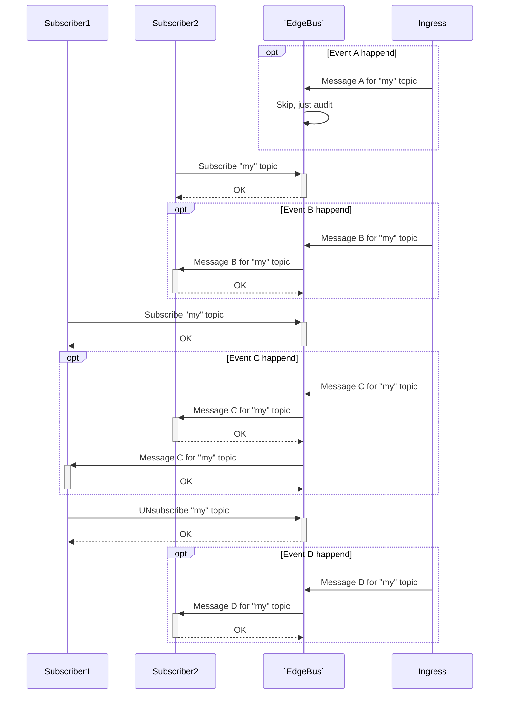

# EdgeBus
`EdgeBus` is a Notification Server that implements [Publish–Subscribe](https://en.wikipedia.org/wiki/Publish%E2%80%93subscribe_pattern) Pattern. Main responsibility is to deliver callback messages via Webhooks and other messaging providers.

!!! note "Recommendation"
	Although notification includes real and valid data, we recommend to use notifications just as notifications and retvieve data via appropriate method of Pull API ([REST API](../api) for example).
	In general, any notifications system by design may delay messages. Good practice for end-application is to check status via Pull API if expected message was not received in expected time frame.

## General information

### Use-cases



### Delivery
Messages are sent immediately after an operation was performed.

`EdgeBus` records the fact of message delivery to your system after receiving the response from your system.

If message delivery is failed the server will retry with delay between attempts according to a scale was choosen at subscription phase.

For example powers of two scale will retry delivery until the period does not exceed 16384 seconds (~4.5hours): 1, 2, 4, 8, 16, ..., 16384(max).

Notification server performs attempts to deliver a message within 3 days.

### Selecting message format
Along with setup your notification endpoint, you may choose message format.

#### [JSON-RPC](https://www.jsonrpc.org/specification)
Using JSON-RPC in notification manner
```JSON
--> {"jsonrpc": "2.0", "method": "somethingChanged", "params": { "id": "68ac6741f92d41fbbc894ab406fcc91d", ...... }}
--> {"jsonrpc": "2.0", "method": "somethingAdded", "params": { "id": "3d80cbbe", ...... }}
```

#### [Protocol Buffers Version 2](https://developers.google.com/protocol-buffers/docs/reference/proto2-spec)
Using Protocol Buffers for message serialization. See definition .proto file for details.

### Message security
`EdgeBus` provides Signing and Encrypt methods to verify that the request is legitimate.

#### Signing message
Message signature provides by a `Ingress` service. `EdgeBus` does not modify provided signature, just deliver it along with message. See for details in events documentation.

#### Encrypt message (Optional)
Optionally (along with signing), you may setup(via Management API) an `encrypt password`, messages will be encrypted.

```Bash tab="Bash + OpenSSL"
TBD
```

```JavaScript tab="NodeJS"
TBD
```

```PHP tab=
TBD
```

## Webhooks
[Webhooks](https://en.wikipedia.org/wiki/Webhook) are "user-defined HTTP
callbacks".
When an event occurs, `EdgeBus` makes an HTTP request to the URI configured for the webhook.

!!! warning
    Your endpoint should ALWAYS return a valid HTTP response with HTTP status 2XX. If you do not do this then EdgeBus will think the hook failed and [retry](#delivery) it.

### Headers
Notification server will include following headers to each request:

* **NF-TIMESTAMP** - A timestamp that was used in [signature](#signing-message) calculation
* **NF-SIGN** - The base64-encoded [signature](#signing-message)

### Security

#### SSL verification
SSL Verification enables automatically for URL scheme `https:`. No additional configuration required.

!!! note "Optional"
	If you specify a CA Certificates (via Merchant Management API), it will be used to verify the SSL certificate of the webhook endpoint. Otherwise the SSL certificate of the webhook endpoint is verified based on an internal list of Certificate Authorities.

#### Secret token
If you setup a `secret token` (via Merchant Management API), it will be sent with the hook request in the **NF-TOKEN** HTTP header.
